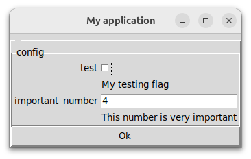

# Mininterface – access to GUI, TUI, CLI and config files
[](https://www.gnu.org/licenses/gpl-3.0)
[](https://github.com/CZ-NIC/mininterface/actions)

Write the program core, do not bother with the input/output.



Check out the code that displays such window, just the code you need. No lengthy blocks of code imposed by an external dependency.

```python
from dataclasses import dataclass
from mininterface import run

@dataclass
class Config:
    """Set of options."""
    test: bool = False
    """My testing flag"""
    important_number: int = 4
    """This number is very important"""

if __name__ == "__main__":
    args: Config = run(Config, prog="My application").get_args()
    print(args.important_number)    # suggested by the IDE with the hint text "This number is very important"
```

Or bound the interface to a `with` statement that redirects stdout directly to the window.

```python
with run(Config) as m:
    print(f"Your important number is {m}")
    boolean = m.is_yes("Is that alright?")
```

TODO img

Loading config file is a piece of cake. Alongside `program.py`, put `program.yaml`. Instantly loaded.

```yaml
important_number: 555
```

TODO img

- [Mininterface – GUI, TUI, CLI and config](#mininterface-gui-tui-cli-and-config)
- [Background](#background)
- [Installation](#installation)
- [Docs](#docs)
  * [`mininterface`](#mininterface)
    + [`run(config=None, interface=GuiInterface, **kwargs)`](#runconfignone-interfaceguiinterface-kwargs)
  * [Interfaces](#interfaces)
    + [`Mininterface(title: str = '')`](#Mininterface-title-str--)
    + [`alert(self, text: str)`](#alert-self-text-str)
    + [`ask(self, text: str) -> str`](#ask-self-text-str-str)
    + [`ask_args(self) -> ~ConfigInstance`](#ask-args-self-configinstance)
    + [`ask_form(self, args: FormDict, title="") -> int`](#ask-form-self-args-FormDict-title)
    + [`ask_number(self, text: str) -> int`](#ask-number-self-text-str-int)
    + [`get_args(self, ask_on_empty_cli=True) -> ~ConfigInstance`](#get-args-self-ask-on-empty-cli-true-configinstance)
    + [`is_no(self, text: str) -> bool`](#is-no-self-text-str-bool)
    + [`is_yes(self, text: str) -> bool`](#is-yes-self-text-str-bool)
    + [`parse_args(self, config: Callable[..., ~ConfigInstance], config_file: pathlib.Path | None = None, **kwargs) -> ~ConfigInstance`](#parse-args-self-config-callable-configinstance-config-file-pathlibpath-none-none-kwargs-configinstance)
  * [Standalone](#standalone)

<small><i><a href='http://ecotrust-canada.github.io/markdown-toc/'>Table of contents generated with markdown-toc</a></i></small>


# Background

Wrapper between the [tyro](https://github.com/brentyi/tyro) `argparse` replacement and [tkinter_form](https://github.com/JohanEstebanCuervo/tkinter_form/) that converts dicts into a GUI.

Writing a small and useful program might be a task that takes fifteen minutes. Adding a CLI to specify the parameters is not so much overhead. But building a simple GUI around it? HOURS! Hours spent on researching GUI libraries, wondering why the Python desktop app ecosystem lags so far behind the web world. All you need is a few input fields validated through a clickable window... You do not deserve to add hundred of lines of the code just to define some editable fields. `mininterface` is here to help.

The config variables needed by your program are kept in cozy dataclasses. Write less! The syntax of [tyro](https://github.com/brentyi/tyro) does not require any overhead (as its `argparse` alternatives do). You just annotate a class attribute, append a simple docstring and get a fully functional application:
* Call it as `program.py --help` to display full help.
* Use any flag in CLI: `program.py --test`  causes `args.test` be set to `True`.
* The main benefit: Launch it without parameters as `program.py` to get a full working window with all the flags ready to be edited.
* Running on a remote machine? Automatic regression to the text interface.

# Installation

Install with a single command from [PyPi](https://pypi.org/project/mininterface/).

```python3
pip install mininterface
```

# Docs

You can easily nest the configuration. (See also [Tyro Hierarchical Configs](https://brentyi.github.io/tyro/examples/02_nesting/01_nesting/)).

Just put another dataclass inside the config file:

```python3
@dataclass
class FurtherConfig:
    token: str
    host: str = "example.org"

@dataclass
class Config:
    further: FurtherConfig

...
print(config.further.host)  # example.org
```

A subset might be defaulted in YAML:

```yaml
further:
  host: example.com
```

Or by CLI:

```
$./program.py --further.host example.net
```

## `mininterface`

### `run(config=None, interface=GuiInterface, **kwargs)`
Wrap your configuration dataclass into `run` to access the interface. Normally, an interface is chosen automatically. We prefer the graphical one, regressed to a text interface on a machine without display.
Besides, if given a configuration dataclass, the function enriches it with the CLI commands and possibly with the default from a config file if such exists. It searches the config file in the current working directory, with the program name ending on *.yaml*, ex: `program.py` will fetch `./program.yaml`.

* `config:ConfigClass`: Dataclass with the configuration.
* `interface`: Which interface to prefer. By default, we use the GUI, the fallback is the REPL.
* `**kwargs`: The same as for [`argparse.ArgumentParser`](https://docs.python.org/3/library/argparse.html).
* Returns: `interface` Interface used.

You cay context manage the function by a `with` statement. The stdout will be redirected to the interface (GUI window).

See the [initial examples](#mininterface-gui-tui-cli-and-config).

## Interfaces

Several interfaces exist:

* `Mininterface` – The base interface. Does not require any user input and hence is suitable for headless testing.
* `GuiInterface` – A tkinter window.
* `TuiInterface` – An interactive terminal.
* `ReplInterface` – A debug terminal. Invokes a breakpoint after every dialog.

You can invoke one directly instead of using [mininterface.run](#run-config-none-interface-guiinterface-kwargs). Then, you can connect a configuration object to the CLI and config file with `parse_args` if needed.

```python
with TuiInterface("My program") as m:
    number = m.ask_number("Returns number")
```

### `Mininterface(title: str = '')`
Initialize.
### `alert(self, text: str)`
Prompt the user to confirm the text.
### `ask(self, text: str) -> str`
Prompt the user to input a text.
### `ask_args(self) -> ~ConfigInstance`
Allow the user to edit whole configuration. (Previously fetched from CLI and config file by parse_args.)
### `ask_form(self, args: FormDict, title="") -> dict`
Prompt the user to fill up whole form.
* `args`: Dict of `{labels: default value}`. The form widget infers from the default value type.
  The dict can be nested, it can contain a subgroup.
  The default value might be `mininterface.FormField` that allows you to add descriptions.
  A checkbox example: `{"my label": FormField(True, "my description")}`
* `title`: Optional form title.
### `ask_number(self, text: str) -> int`
Prompt the user to input a number. Empty input = 0.
### `get_args(self, ask_on_empty_cli=True) -> ~ConfigInstance`
Returns whole configuration (previously fetched from CLI and config file by parse_args).
If program was launched with no arguments (empty CLI), invokes self.ask_args() to edit the fields.
### `is_no(self, text: str) -> bool`
Display confirm box, focusing no.
### `is_yes(self, text: str) -> bool`
Display confirm box, focusing yes.

```python
m = run(prog="My program")
print(m.ask_yes("Is it true?"))  # True/False
```

### `parse_args(self, config: Callable[..., ~ConfigInstance], config_file: pathlib.Path | None = None, **kwargs) -> ~ConfigInstance`
Parse CLI arguments, possibly merged from a config file.
* `config`: Dataclass with the configuration.
* `config_file`: File to load YAML to be merged with the configuration. You do not have to re-define all the settings, you can choose a few.
* `**kwargs` The same as for argparse.ArgumentParser.
* Returns: `ConfigInstance` Configuration namespace.

## Standalone

When invoked directly, it creates simple GUI dialogs.

```bash
$ mininterface  --help
usage: Mininterface [-h] [OPTIONS]

Simple GUI dialog. Outputs the value the user entered.

╭─ options ─────────────────────────────────────────────────────────────────────────────────╮
│ -h, --help              show this help message and exit                                   │
│ --alert STR             Display the OK dialog with text. (default: '')                    │
│ --ask STR               Prompt the user to input a text. (default: '')                    │
│ --ask-number STR        Prompt the user to input a number. Empty input = 0. (default: '') │
│ --is-yes STR            Display confirm box, focusing yes. (default: '')                  │
│ --is-no STR             Display confirm box, focusing no. (default: '')                   │
╰───────────────────────────────────────────────────────────────────────────────────────────╯
```

You can fetch a value to i.e. a bash script.

```bash
$ mininterface  --ask-number "What's your age?"  # GUI window invoked
18
```
