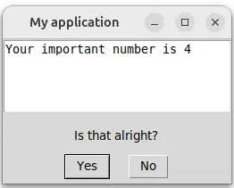

# Mininterface – access to GUI, TUI, CLI and config files
[](https://www.gnu.org/licenses/gpl-3.0)
[](https://github.com/CZ-NIC/mininterface/actions)

Write the program core, do not bother with the input/output.


Check out the code, which is surprisingly short, that displays such a window or its textual fallback.

```python
from dataclasses import dataclass
from mininterface import run

@dataclass
class Env:
    """Set of options."""

    test: bool = False
    """ My testing flag """

    important_number: int = 4
    """ This number is very important """

if __name__ == "__main__":
    env = run(Env, prog="My application").env
    # Attributes are suggested by the IDE
    # along with the hint text 'This number is very important'.
    print(env.important_number)
```

## You got CLI
It was all the code you need. No lengthy blocks of code imposed by an external dependency. Besides the GUI/TUI, you receive powerful YAML-configurable CLI parsing.

```bash
$ ./hello.py
usage: My application [-h] [--test | --no-test] [--important-number INT]

Set of options.

╭─ options ──────────────────────────────────────────────────────────╮
│ -h, --help              show this help message and exit            │
│ --test, --no-test       My testing flag (default: False)           │
│ --important-number INT  This number is very important (default: 4) │
╰────────────────────────────────────────────────────────────────────╯
```

## You got config file management
Loading config file is a piece of cake. Alongside `program.py`, put `program.yaml` and put there some of the arguments. They are seamlessly taken as defaults.

```yaml
important_number: 555
```

## You got dialogues
Check out several useful methods to handle user dialogues. Here we bound the interface to a `with` statement that redirects stdout directly to the window.

```python
with run(Env) as m:
    print(f"Your important number is {m.env.important_number}")
    boolean = m.is_yes("Is that alright?")
```




# Contents
- [Mininterface – GUI, TUI, CLI and config](#mininterface-gui-tui-cli-and-config)
- [Background](#background)
- [Installation](#installation)
- [Docs](#docs)
  * [`mininterface`](#mininterface)
    + [`run`](#run)
    + [`FormField`](#formfield)
    + [`validators`](#validators)
  * [Interfaces](#interfaces)
    + [`Mininterface`](#mininterface)
    + [`alert`](#alert)
    + [`ask`](#ask)
    + [`ask_number`](#ask_number)
    + [`form`](#form)
    + [`is_no`](#is_no)
    + [`is_yes`](#is_yes)
  * [Standalone](#standalone)

# Background

Wrapper between the [tyro](https://github.com/brentyi/tyro) `argparse` replacement and [tkinter_form](https://github.com/JohanEstebanCuervo/tkinter_form/) that converts dicts into a GUI.

Writing a small and useful program might be a task that takes fifteen minutes. Adding a CLI to specify the parameters is not so much overhead. But building a simple GUI around it? HOURS! Hours spent on researching GUI libraries, wondering why the Python desktop app ecosystem lags so far behind the web world. All you need is a few input fields validated through a clickable window... You do not deserve to add hundred of lines of the code just to define some editable fields. `Mininterface` is here to help.

The config variables needed by your program are kept in cozy dataclasses. Write less! The syntax of [tyro](https://github.com/brentyi/tyro) does not require any overhead (as its `argparse` alternatives do). You just annotate a class attribute, append a simple docstring and get a fully functional application:
* Call it as `program.py --help` to display full help.
* Use any flag in CLI: `program.py --test`  causes `env.test` be set to `True`.
* The main benefit: Launch it without parameters as `program.py` to get a full working window with all the flags ready to be edited.
* Running on a remote machine? Automatic regression to the text interface.

# Installation

Install with a single command from [PyPi](https://pypi.org/project/mininterface/).

```bash
pip install mininterface
```

# Docs

You can easily nest the configuration. (See also [Tyro Hierarchical Configs](https://brentyi.github.io/tyro/examples/02_nesting/01_nesting/)).

Just put another dataclass inside the config file:

```python3
@dataclass
class FurtherConfig:
    token: str
    host: str = "example.org"

@dataclass
class Config:
    further: FurtherConfig

...
print(config.further.host)  # example.org
```

A subset might be defaulted in YAML:

```yaml
further:
  host: example.com
```

Or by CLI:

```
$./program.py --further.host example.net
```

## `mininterface`

### `run`
*(env_class=None, ask_on_empty_cli=False, title="", config_file=True, interface=GuiInterface or TuiInterface, \*\*kwargs)*

The main access, start here.
Wrap your configuration dataclass into `run` to access the interface. An interface is chosen automatically,
with the preference of the graphical one, regressed to a text interface for machines without display.
Besides, if given a configuration dataclass, the function enriches it with the CLI commands and possibly
with the default from a config file if such exists.
It searches the config file in the current working directory,
with the program name ending on *.yaml*, ex: `program.py` will fetch `./program.yaml`.

* `env_class`: Dataclass with the configuration. Their values will be modified with the CLI arguments.
* `ask_on_empty_cli`: If program was launched with no arguments (empty CLI), invokes self.form() to edit the fields.
(Withdrawn when `ask_for_missing` happens.)
```python
@dataclass
class Env:
  number: int = 3
  text: str = ""
m = run(Env, ask_on_empty_cli=True)
```

```bash
$ program.py --number 3
# No dialog appear
$ program.py  # no flag omitting
# Dialog for `number` and `text` appears
```
* `title`: The main title. If not set, taken from `prog` or program name.
* `config_file`: File to load YAML to be merged with the configuration.
  You do not have to re-define all the settings in the config file, you can choose a few.
  If set to True (default)form(, we try to find one in the current working dir,
  whose name stem is the same as the program's.
  Ex: `program.py` will search for `program.yaml`.
  If False, no config file is used.
* `add_verbosity`: Adds the verbose flag that automatically sets the level to `logging.INFO` (*-v*) or `logging.DEBUG` (*-vv*).

```python
import logging
logger = logging.getLogger(__name__)

m = run(Env, add_verbosity=True)
logger.info("Info shown") # needs `-v` or `--verbose`
logger.debug("Debug not shown")  # needs `-vv`
# $ program.py --verbose
# Info shown
```

```bash
$ program.py --verbose
Info shown
```
* `ask_for_missing`: If some required fields are missing at startup, we ask for them in a UI instead of program exit.

```python
@dataclass
class Env:
  required_number: int
m = run(Env, ask_for_missing=True)
```

```bash
$ program.py  # omitting --required-number
# Dialog for `required_number` appears
```

* `interface`: Which interface to prefer. By default, we use the GUI, the fallback is the TUI.
* `**kwargs` The same as for [argparse.ArgumentParser](https://docs.python.org/3/library/argparse.html).
* Returns: `Mininterface` An interface, ready to be used.

You cay context manager the function by a `with` statement. The stdout will be redirected to the interface (ex. a GUI window).

See the [initial examples](#mininterface-access-to-gui-tui-cli-and-config-files).

### `FormField`
Enrich a value with a description, validation etc. When you provide a value to an interface, you may instead use this object.
* `val`: The value being enriched by this object.
* `description`: *str* The description displayed in the UI.
* `annotation`: *type* Used for validation. To convert an empty '' to None. If not set, will be determined automatically from the `val` type.
* `name`: *str* Name displayed in the UI. (NOTE: Only TextualInterface uses this by now.)
* `validation`: *Callable[[FormField], ValidationResult]*
    When the user submits the form, the values are validated (and possibly transformed) with a callback function.
        If the validation fails, user is prompted to edit the value.
        Return True if validation succeeded or False or an error message when it failed.

```python
def check(ff: FormField):
    if ff.val < 10:
        return "The value must be at least 10"
m.form({"number", FormField(12, validation=check)})
```

Either use a custom callback function or mininterface.validators.

```python
from mininterface.validators import not_empty
m.form({"number", FormField("", validation=not_empty)})
# User cannot leave the field empty.
```

* `original_val`: The original value, preceding UI change. Handy while validating.

```python
def check(ff.val):
    if ff.val != ff.original_val:
        return "You have to change the value."
m.form({"number", FormField(8, validation=check)})
```

## `validators`

Functions suitable for FormField validation.

### `not_empty`

Assures that FormField the user has written a value and did not let the field empty.

```python
from mininterface import FormField, validators

m.form({"number", FormField("", validation=validators.not_empty)})
# User cannot leave the string field empty.
```

Note that for Path, an empty string is converted to an empty Path('.'),
hence '.' too is considered as an empty input and the user
is not able to set '.' as a value.
This does not seem to me as a bad behaviour as in CLI you clearly see the CWD,
whereas in a UI the CWD is not evident.

## Interfaces

Several interfaces exist:

* `Mininterface` – The base interface. Does not require any user input and hence is suitable for headless testing.
* `GuiInterface` – A tkinter window.
* `TuiInterface` – An interactive terminal.
  * `TextualInterface` – If [textual](https://github.com/Textualize/textual) installed, rich interface is used.
  * `TextInterface` – Plain text only interface with no dependency as a fallback.
* `ReplInterface` – A debug terminal. Invokes a breakpoint after every dialog.

Normally, you get an interface through [mininterface.run](#run) but if you do not wish to parse CLI and config file, you can invoke one directly.

```python
with TuiInterface("My program") as m:
    number = m.ask_number("Returns number")
```

### `Mininterface`
*(title: str = '')* The base interface.
You get one through `mininterface.run` which fills CLI arguments and config file to `mininterface.env`
or you can create it directly (without benefiting from the CLI parsing).
### `alert`
*(text: str)* Prompt the user to confirm the text.
### `ask`
*(text: str) -> str* Prompt the user to input a text.
### `ask_number`
*(text: str) -> int* Prompt the user to input a number. Empty input = 0.
### `form`
*(env: FormDict, title="") -> dict* Prompt the user to fill up whole form.
* `form:` Dict of `{labels: default value}`. The form widget infers from the default value type.
  The dict can be nested, it can contain a subgroup.
  The default value might be `mininterface.FormField` that allows you to add descriptions.
  If None, the `self.env` is being used as a form, allowing the user to edit whole configuration. (Previously fetched from CLI and config file.)
  A checkbox example: `{"my label": FormField(True, "my description")}`
* `title`: Optional form title.
### `is_no`
*(text: str) -> bool* Display confirm box, focusing no.
### `is_yes`
*(text: str) -> bool* Display confirm box, focusing yes.

```python
m = run(prog="My program")
print(m.ask_yes("Is it true?"))  # True/False
```

## Standalone

When invoked directly, it creates simple GUI dialogs.

```bash
$ mininterface  --help
usage: Mininterface [-h] [OPTIONS]

Simple GUI dialog. Outputs the value the user entered.

╭─ options ─────────────────────────────────────────────────────────────────────────────────╮
│ -h, --help              show this help message and exit                                   │
│ --alert STR             Display the OK dialog with text. (default: '')                    │
│ --ask STR               Prompt the user to input a text. (default: '')                    │
│ --ask-number STR        Prompt the user to input a number. Empty input = 0. (default: '') │
│ --is-yes STR            Display confirm box, focusing yes. (default: '')                  │
│ --is-no STR             Display confirm box, focusing no. (default: '')                   │
╰───────────────────────────────────────────────────────────────────────────────────────────╯
```

You can fetch a value to i.e. a bash script.

```bash
$ mininterface  --ask-number "What's your age?"  # GUI window invoked
18
```
