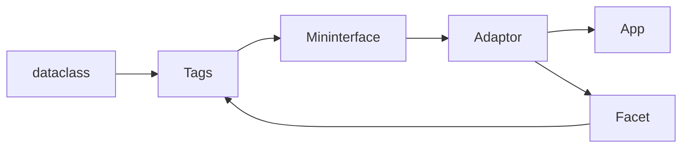

# Dev Guide

## New features

All pull requests are welcome. Let's make script creation a better experience together. Alongside code base change, modify:

* [CHANGELOG.md]()
* increase version in pyproject.toml

If adding a dependency, make sure to reflect that in pyproject.toml and in [README.md](index.md#installation) install section.

## Interface architecture

Every interface has several uniform objects:

* Mininterface: front-end for the programmer. Easy to use and uniform methods.
* Adaptor: Connection point. Public attributes not meant to be used by the (end-user) programmer.
* App (optional): External library UI handler. (Like tkinter.)
* Facet: Layout definition.

Programmer uses a value -> which is converted to Tag -> which is converted to a widget by an interface Adaptor.

## Adaptor

::: mininterface._mininterface.adaptor.BackendAdaptor