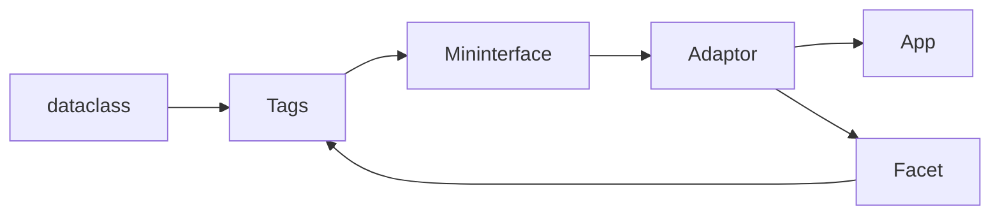

# Dev Guide

## New features

All pull requests are welcome. Let's make script creation a better experience together. Alongside the code base change, modify:

* [CHANGELOG.md](Changelog.md)
* increase version in pyproject.toml

If adding a dependency, make sure to reflect that in pyproject.toml and in the [README.md](index.md#installation) installation section.

## Interface architecture

Every interface has several uniform objects:

* Mininterface: front-end for the programmer. Easy-to-use, uniform methods.
* Adaptor: Connection point. Its public attributes are not meant to be used by the (end-user) programmer.
* App (optional): External library UI handler. (Like tkinter.)
* Facet: Layout definition.

```mermaid
graph LR
dataclass --> Tags --> Mininterface --> Adaptor --> App
Adaptor --> Facet
Facet --> Tags
```

The programmer uses a value, which is converted to a Tag, which the interface Adaptor converts into a widget.

## Adaptor

::: mininterface._mininterface.adaptor.BackendAdaptor