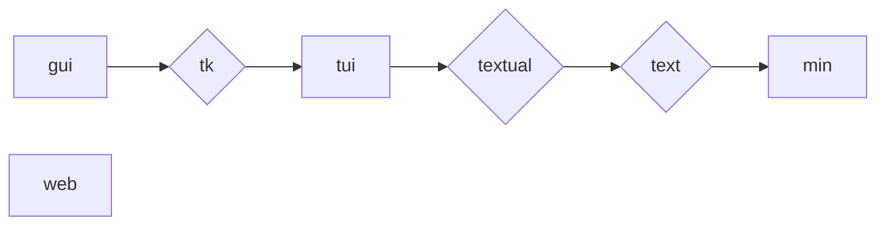

## All possible interfaces

Apart from the default [`Mininterface`][mininterface.Mininterface] – the base interface all the others are fully compatible with – several interfaces exist in `mininterface.interfaces`.

| shortcut | full name |
| -- | -- |
| min | [Mininterface](#mininterface) |
| gui | [GuiInterface](#guiinterface-or-tkinterface-or-gui) \| TkInterface |
| tui \| textual | [TuiInterface](#tuiinterface-or-tui) |
| text \| tui | [TextInterface](#textinterface) |
| web | [WebInterface](#webinterface-or-web) |

### Ordering

We try to obtain the best interface available. The preference is **gui**, then **tui** (textual, or at least **text**); finally, the original non-interactive **min** is used. This ensures the program still works in cron jobs etc. (**Web** is never chosen automatically.)



### Getting one

Normally, you get an interface through [mininterface.run][]
but if you do not wish to parse the CLI and config file, you can invoke one directly through `from mininterface.interfaces import *`. You may as well use the [`get_interface`][mininterface.interfaces.get_interface] function to ensure the interface is available, or invoke the program with the [`MININTERFACE_INTERFACE`](#environment-variable-mininterface_interface) environment variable.

!!! info
    Performance boost: Only the interfaces actually used are loaded into memory, for a faster start.

### Direct invocation

How to invoke a specific interface directly?

```python
from mininterface.interfaces import TuiInterface

with TuiInterface("My program") as m:
    number = m.ask("Returns number", int)
```

::: mininterface.interfaces.get_interface
    options:
        show_signature: false
        show_root_full_path: false

### Environment variable `MININTERFACE_INTERFACE`

From outside, you may override the default interface choice with the environment variable.

`$ MININTERFACE_INTERFACE=web program.py`

# `Mininterface`

The base interface. It is configured via [`UiSettings`][mininterface.settings.UiSettings].

Non-interactive; it behaves as if the user confirmed everything. Useful e.g. in cron scripts.

```bash
$ MININTERFACE_INTERFACE=min ./program.py
Asking the form Env(my_flag=False, my_number=4)
4
```

??? Code
    ```python
    from dataclasses import dataclass
    from mininterface import run

    @dataclass
    class Env:
        """ This calculates something. """

        my_flag: bool = False
        """ This switches the functionality """

        my_number: int = 4
        """ This number is very important """

    if __name__ == "__main__":
        m = run(Env, title="My application")
        m.form()
        # Attributes are suggested by the IDE
        # along with the hint text 'This number is very important'.
        print(m.env.my_number)
    ```

If that is not possible, the program ends with a warning.

```bash
$ MININTERFACE_INTERFACE=gui ./program.py
Asking the form Env(my_flag=MISSING, my_number=4)
the following arguments are required: --my-flag
```

??? Code
    ```python
    from dataclasses import dataclass
    from mininterface import run

    @dataclass
    class Env:
        """ This calculates something. """

        my_flag: bool # no default value here
        """ This switches the functionality """

        my_number: int = 4
        """ This number is very important """

    if __name__ == "__main__":
        m = run(Env, title="My application")
        m.form()
    ```

# `GuiInterface` or `TkInterface` or 'gui'

A tkinter window. It is configured via [`GuiSettings`][mininterface.settings.GuiSettings].

```bash
$ MININTERFACE_INTERFACE=gui ./program.py
```


# `TuiInterface` or 'tui'

An interactive terminal. It tries to use `TextualInterface`, with `TextInterface` as a fallback. Configured via [`TuiSettings`][mininterface.settings.TuiSettings].

## `TextualInterface`

If [textual](https://github.com/Textualize/textual) is installed, a rich, mouse-clickable interface is used. It is configured via [`TextualSettings`][mininterface.settings.TextualSettings].

```bash
$ MININTERFACE_INTERFACE=tui ./program.py
```


## `TextInterface`

A plain-text fallback interface with no dependencies. It is configured via [`TextSettings`][mininterface.settings.TextSettings]. A non-interactive session becomes interactive if possible, but there is no mouse support. Unlike TextualInterface, it does not clear the whole screen, should that suit your program flow better.

```bash
$ MININTERFACE_INTERFACE=text ./program.py
```


# `WebInterface` or 'web'

Exposes the program to the web. It is configured via [`WebSettings`][mininterface.settings.WebSettings].

You can expose any script to the web by invoking it through the bundled `mininterface` program.


```bash
$ mininterface web ./program.py --port 9997
```

Still, you can request the web interface by preference in the `run` or `get_interface` method, invoke it directly by importing `WebInterface` from `mininterface.interfaces`, or use the environment variable.

```bash
$ MININTERFACE_INTERFACE=web ./program.py
Serving './program.py' on http://localhost:64646

Press Ctrl+C to quit
```


!!! Caveat
    Should you plan to use the WebInterface, we recommend making its invocation the first thing your program does. All the statements before it run multiple times!

    ```python
    hello = "world"  # This line would run for every browser client!
    with run(interface="web") as m:
        m.form({"one": 1})
        m.form({"two": 2})
    ```

!!! Warning
    Still in beta. We appreciate help with testing etc.
