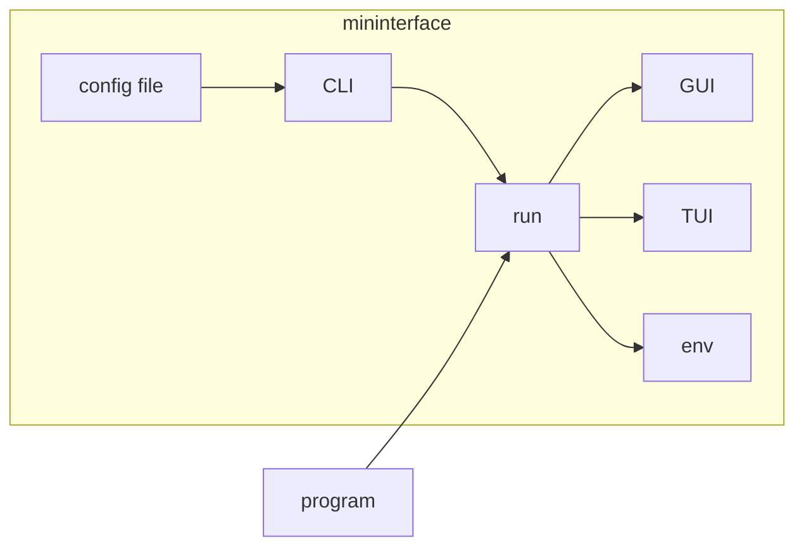

Via the [run][mininterface.run] function you get access to the CLI, possibly enriched from the config file. Then, you receive all data as [`m.env`][mininterface.Mininterface.env] object and dialog methods in a proper UI.



## Basic usage
Use a common [dataclass](https://docs.python.org/3/library/dataclasses.html#dataclasses.dataclass), a Pydantic [BaseModel](https://brentyi.github.io/tyro/examples/04_additional/08_pydantic/) or an [attrs](https://brentyi.github.io/tyro/examples/04_additional/09_attrs/) model to store the configuration. Wrap it to the [run][mininterface.run] function that returns an interface `m`. Access the configuration via [`m.env`][mininterface.Mininterface.env] or use it to prompt the user [`m.is_yes("Is that alright?")`][mininterface.Mininterface.is_yes].

There are a lot of supported [types](/Types) you can use, not only scalars and well-known objects (`Path`, `datetime`), but also functions, iterables (like `list[Path]`) and union types (like `int | None`). To do even more advanced things, stick the value to a powerful [`Tag`][mininterface.Tag] or its subclasses. Ex. for a validation only, use its [`Validation alias`](Validation.md/#validation-alias).

At last, use [`Facet`](Facet.md) to tackle the interface from the back-end (`m`) or the front-end (`Tag`) side.

## IDE suggestions

The immediate benefit is the type suggestions you see in an IDE. Imagine following code:

```python
from dataclasses import dataclass
from mininterface import run

@dataclass
class Env:
    my_paths: list[Path]
    """ The user is forced to input Paths. """


@dataclass
class Dialog:
    my_number: int = 2
    """ A number """
```

Now, accessing the main [env][mininterface.Mininterface.env] will trigger the hint.


Calling the [form][mininterface.Mininterface.form] with an empty parameter will trigger editing the main [env][mininterface.Mininterface.env]


Putting there a dict will return the dict too.


Putting there a dataclass type causes it to be resolved.


Should you have a resolved dataclass instance, put it there.


As you see, its attributes are hinted alongside their description.


Should the dataclass cannot be easily investigated by the IDE (i.e. a required field), just annotate the output.


## Bash completion

Run your program with a hidden `--integrate-to-system` flag and a tutorial will install bash completion.


## Nested configuration
You can easily nest the configuration. (See also [Tyro Hierarchical Configs](https://brentyi.github.io/tyro/examples/02_nesting/01_nesting/)).

Just put another dataclass inside the config file:

```python3
@dataclass
class FurtherConfig:
    token: str
    host: str = "example.org"

@dataclass
class Env:
    further: FurtherConfig

...
m = run(Env)
print(m.env.further.host)  # example.org
```

The attributes can by defaulted by CLI:

```
$./program.py --further.host example.net
```

And in a YAML config file. Note that you are not obliged to define all the attributes, a subset will do.
(Ex. you do not need to specify `token` too.)

```yaml
further:
  host: example.com
```


## All possible interfaces

Normally, you get an interface through [mininterface.run][]
but if you do not wish to parse CLI and config file, you can invoke one directly.

Several interfaces exist:

* [`Mininterface`][mininterface.Mininterface] – The base interface the others are fully compatible with.
* `GuiInterface` = `TkInterface` – A tkinter window.
* `TuiInterface` – An interactive terminal.
    * `TextualInterface` – If [textual](https://github.com/Textualize/textual) installed, rich interface is used.
    * `TextInterface` – Plain text only interface with no dependency as a fallback.
* `ReplInterface` – A debug terminal. Invokes a breakpoint after every dialog.


How to invoke a specific interface.

```python
with TuiInterface("My program") as m:
    number = m.ask_number("Returns number")
```