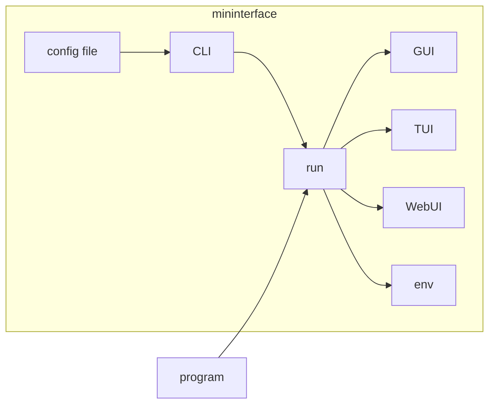

Via the [run][mininterface.run] function you get access to the CLI, possibly enriched from the config file. Then, you receive all the data in the [`m.env`][mininterface.Mininterface.env] object, along with dialog methods in a proper UI.


```mermaid
graph LR
    subgraph mininterface
        run --> GUI
        run --> TUI
        run --> WebUI
        run --> env
        CLI --> run
        id1[config file] --> CLI
    end
    program --> run
```

## Basic usage

Use a common [dataclass](https://docs.python.org/3/library/dataclasses.html#dataclasses.dataclass), an argparse [`ArgumentParser`](https://docs.python.org/3/library/argparse.html#argparse.ArgumentParser), a Pydantic [BaseModel](https://brentyi.github.io/tyro/examples/04_additional/08_pydantic/) or an [attrs](https://brentyi.github.io/tyro/examples/04_additional/09_attrs/) model to store the configuration. Wrap it in the [run][mininterface.run] function that returns an interface `m`. Access the configuration via [`m.env`][mininterface.Mininterface.env] or use it to prompt the user with methods like [`m.confirm("Is that alright?")`][mininterface.Mininterface.confirm].

There are a lot of supported [types](Supported-types.md) you can use, not only scalars and well-known objects (`Path`, `datetime`), but also functions, iterables (like `list[Path]`) and union types (like `int | None`). To do even more advanced things, attach the value to a powerful [`Tag`][mininterface.Tag] or its [subclasses](Supported-types.md#additional). E.g. for validation only, use its [`Validation alias`][mininterface.tag.alias.Validation].

Finally, use [`Facet`](Facet.md) to access the interface from the back-end (`m`) or the front-end (`Tag`) side.

## `with run() as m:` — persistent window

Wrap your code in a `with` statement to keep the window open across multiple dialogs:

```python
with run(Env) as m:
    print(f"Your number is {m.env.my_number}")
    if m.confirm("Is that alright?"):
        m.alert("Great!")
```

Three things happen inside the block:

* The window **stays open** — each `m.form()` / `m.confirm()` / … reuses the same window rather than creating a new one.
* **`print()` is redirected** into the UI instead of the terminal.
* A **non-interactive TTY** (e.g. a script launched from a desktop shortcut) becomes interactive where possible (TextInterface).

When the block exits, stdout is restored. Any output that was buffered but not yet shown in the window is reprinted to the real terminal.

See [Dialog methods](Dialogs.md) for the full list of available dialogs.

## IDE suggestions

The immediate benefit is the type suggestions provided by your IDE.

### Dataclass showcase

Imagine the following code:

```python
from dataclasses import dataclass
from mininterface import run

@dataclass
class Env:
    my_paths: list[Path]
    """ The user is forced to input Paths. """


@dataclass
class Dialog:
    my_number: int = 2
    """ A number """
```

Now, accessing the main [env][mininterface.Mininterface.env] will trigger the hint.


Calling [form][mininterface.Mininterface.form] with an empty parameter will trigger editing the main [env][mininterface.Mininterface.env].


Passing a dict will return the dict too.


Passing a dataclass type causes it to be resolved.


Should you have a resolved dataclass instance, pass it in.


As you see, its attributes are hinted alongside their description.


Should the dataclass be hard for the IDE to investigate (e.g. due to a required field), just annotate the output.


### Select showcase

We aim for intuitive type inference everywhere. Here is an example with the [`m.select`][mininterface.Mininterface.select] dialog.

```python
from mininterface import run

m = run()
# x = m.select([1, 2, 3], default=2)  # -> int
# x = m.select([1, 2, 3], multiple=True)  # -> list[int]
# x = m.select([1, 2, 3], default=[2])  # -> list[int]
```

By default, the inferred type is an `int`.


When you flag the selection as multiple, or when you submit multiple default values...


...your IDE sees a `list` instead of a single value, so you can directly append to it etc.


## Nested configuration
You can easily nest the configuration. (See also [Tyro Hierarchical Configs](https://brentyi.github.io/tyro/examples/02_nesting/01_nesting/).)

Just put another dataclass inside your main one:

```python
@dataclass
class FurtherConfig:
    token: str
    host: str = "example.org"

@dataclass
class Env:
    further: FurtherConfig

...
m = run(Env)
print(m.env.further.host)  # example.org
```

The attributes can be set via the CLI:

```
$./program.py --further.host example.net
```

Or via a YAML config file. Note that you are not obliged to define all the attributes; a subset will do.
(E.g. you do not need to specify `token`.)

```yaml
further:
  host: example.com
```

## Bash completion

Run your program through the bundled `mininterface` executable to start a tutorial that installs bash completion.

`$ mininterface integrate ./program`


## System dialog toolkit

Mininterface can be used as a standalone dialog layer for sh scripts. See `mininterface --help`.

```bash
$ mininterface select one two  # outputs a chosen item
```

