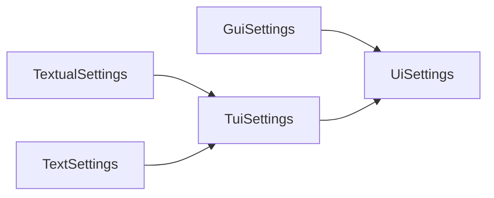

## UI Settings

The UI behaviour might be modified via an settings object. This can be passed to the [run][mininterface.run] function or defined through a config file. Settings defined in the config file have bigger priority. Every interface has its own settings object.

Passing the settings to the `run` method:

```python
from mininterface.settings import MininterfaceSettings

opt = MininterfaceSettings()
run(settings=opt)
```

Specifying only the `GuiSettings`:
```python
from mininterface.settings import GuiSettings

opt = GuiSettings(combobox_since=1)
run(settings=opt)
```

Specifying the `GuiSettings` + turning off the mnemonic for all UIs (not only gui, but also text, ...):
```python
from mininterface.settings import MininterfaceSettings, GuiSettings, UiSettings

opt = MininterfaceSettings(
    gui=GuiSettings(combobox_since=1),
    ui=UiSettings(mnemonic=False)
)
run(settings=opt)
```

Specifying via dataclasses is very convenient as your ID suggests all the options available, including its hints.


### Config file special section
In a YAML config file, use a special section 'mininterface' to set up the UI. For example, this stub will enforce your program to use the Tui interface.

```yaml
mininterface:
    interface: tui
```

#### Complete example

Source of `program.py`, we have one single attribute `foo`:

```python
from typing import Annotated
from dataclasses import dataclass
from mininterface import run, Options

@dataclass
class Env:
    foo: Annotated["str", Options("one", "two")] = "one"

m = run(Env)
m.form()
```

Source of `program.yaml` will enforce the comboboxes:

```yaml
number: 5
mininterface:
    gui:
        combobox_since: 1
```

The difference when using such configuration file.

 

### Inheritance

The individual setting items are inherited, while the descendants have the higher priority. Ex. `TuiSettings` works as a default for `TextSettings` and `TextualSettings`.



Ex. this config file sets the `UiSettings` item [`mnemonic`][mininterface.settings.UiSettings.mnemonic] to `None` for `TuiSettings` and more specifically to `False` for `TextSettings`.

```yaml
mininterface:
    tui:
        mnemonic: null
    text:
        mnemonic: False
```

For the different interfaces, the value varies this way:

| interface | mnemonic value |
| -- | -- |
| gui | True (the `UiSettings` item default) |
| textual | None |
| text | False |

## The settings object

::: mininterface.settings.MininterfaceSettings
    options:
        show_root_full_path: false

::: mininterface.settings.UiSettings
    options:
        show_root_full_path: false

::: mininterface.settings.GuiSettings
    options:
        show_root_full_path: false

::: mininterface.settings.TuiSettings
    options:
        show_root_full_path: false

::: mininterface.settings.TextualSettings
    options:
        show_root_full_path: false

::: mininterface.settings.TextSettings
    options:
        show_root_full_path: false