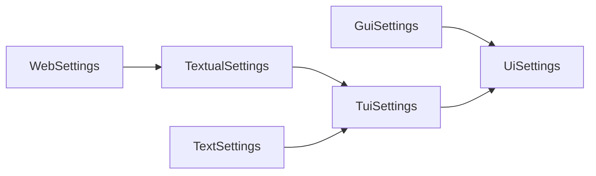

## UI Settings

The UI behaviour can be modified via a settings object. It can be passed to the [run][mininterface.run] function or defined through a config file. Settings defined in the config file take precedence. Every interface has its own settings object.

Passing the settings to the `run` method:

```python
from mininterface.settings import MininterfaceSettings

opt = MininterfaceSettings()
run(settings=opt)
```

Specifying only the `GuiSettings`:
```python
from mininterface.settings import GuiSettings

opt = GuiSettings(combobox_since=1)
run(settings=opt)
```

Specifying the `GuiSettings` + turning off the mnemonic for all UIs (not only gui, but also text, ...):
```python
from mininterface.settings import MininterfaceSettings, GuiSettings, UiSettings

opt = MininterfaceSettings(
    gui=GuiSettings(combobox_since=1),
    ui=UiSettings(mnemonic=False)
)
run(settings=opt)
```

Specifying the settings via dataclasses is very convenient, as your IDE suggests all the available options, including their hints.


### Config file special section
In a YAML config file, use the special section 'mininterface' to set up the UI. For example, this stub will force your program to use the TUI interface.

```yaml
mininterface:
    interface: tui
```

#### Complete example

The source of `program.py` – we have a single attribute `foo`:

```python
from typing import Annotated
from dataclasses import dataclass
from mininterface import run, Options

@dataclass
class Env:
    foo: Annotated["str", Options("one", "two")] = "one"

m = run(Env)
m.form()
```

The contents of `program.yaml` will enforce comboboxes:

```yaml
number: 5
mininterface:
    gui:
        combobox_since: 1
```

The difference when using such a configuration file:

 

### Inheritance

The individual settings items are inherited, with the descendants having higher priority. E.g. `TuiSettings` works as a default for `TextSettings` and `TextualSettings`.


```mermaid
graph LR
GuiSettings --> UiSettings
TuiSettings  --> UiSettings
TextualSettings --> TuiSettings
TextSettings --> TuiSettings
WebSettings --> TextualSettings
```

E.g. this config file sets the `UiSettings` item [`mnemonic`][mininterface.settings.UiSettings.mnemonic] to `None` for `TuiSettings` and more specifically to `False` for `TextSettings`.

```yaml
mininterface:
    tui:
        mnemonic: null
    text:
        mnemonic: False
```

The value then varies across the interfaces this way:

| interface | mnemonic value |
| -- | -- |
| gui | True (the `UiSettings` item default) |
| textual | None |
| text | False |

## The settings object

::: mininterface.settings.MininterfaceSettings
    options:
        show_root_full_path: false

::: mininterface.settings.UiSettings
    options:
        show_root_full_path: false

::: mininterface.settings.GuiSettings
    options:
        show_root_full_path: false

::: mininterface.settings.TuiSettings
    options:
        show_root_full_path: false

::: mininterface.settings.TextualSettings
    options:
        show_root_full_path: false

::: mininterface.settings.TextSettings
    options:
        show_root_full_path: false

::: mininterface.settings.WebSettings
    options:
        show_root_full_path: false

::: mininterface.settings.CliSettings
    options:
        show_root_full_path: false